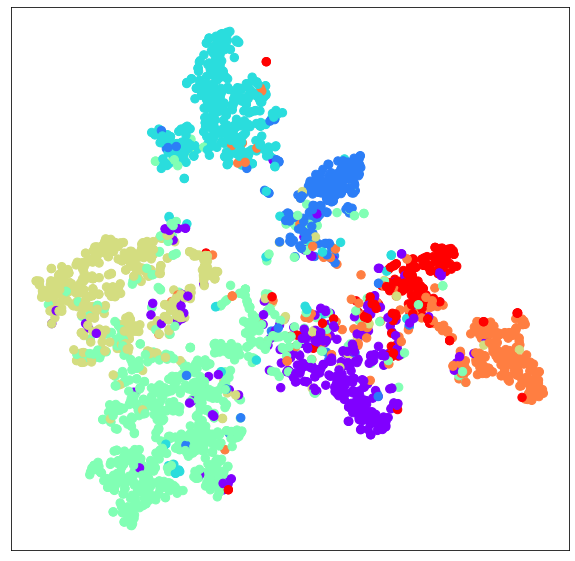
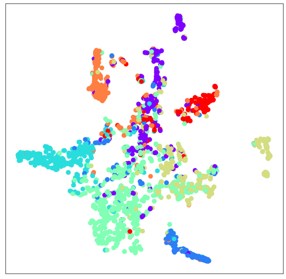

# Task03 基于图神经网络的节点表征学习

## 一、基本知识

* 基于图神经网络做预测：首先需要生成节点表征。高质量节点表征应该能用于衡量节点的相似性，然后基于节点表征可以实现高准确性的节点预测或边预测，因此节点表征的生成是图节点预测和边预测任务成功的关键

* 节点预测任务基本过程：我们拥有一个图，图上有很多节点，部分节点的标签已知，剩余节点的标签未知。将节点的属性（`x`）、边的端点信息（`edge_index`）、边的属性（`edge_attr`，如果有的话）输入到多层图神经网络，经过图神经网络每一层的一次节点间信息传递，图神经网络为节点生成节点表征。
* 目标：根据节点的属性(可以是类别型、也可以是数值型)、边的信息、边的属性（如果有的话）、已知的节点预测标签，对未知标签的节点做预测。


```python
from torch_geometric.datasets import Planetoid
from torch_geometric.transforms import NormalizeFeatures

dataset = Planetoid(root='data/Planetoid', name='Cora', transform=NormalizeFeatures())

print()
print(f'Dataset: {dataset}:')
print('======================')
print(f'Number of graphs: {len(dataset)}')
print(f'Number of features: {dataset.num_features}')
print(f'Number of classes: {dataset.num_classes}')

data = dataset[0]  # Get the first graph object.

print()
print(data)
print('======================')

# Gather some statistics about the graph.
print(f'Number of nodes: {data.num_nodes}')
print(f'Number of edges: {data.num_edges}')
print(f'Average node degree: {data.num_edges / data.num_nodes:.2f}')
print(f'Number of training nodes: {data.train_mask.sum()}')
print(f'Training node label rate: {int(data.train_mask.sum()) / data.num_nodes:.2f}')
print(f'Contains isolated nodes: {data.contains_isolated_nodes()}')
print(f'Contains self-loops: {data.contains_self_loops()}')
print(f'Is undirected: {data.is_undirected()}')

```


    Dataset: Cora():
    ======================
    Number of graphs: 1
    Number of features: 1433
    Number of classes: 7
    
    Data(edge_index=[2, 10556], test_mask=[2708], train_mask=[2708], val_mask=[2708], x=[2708, 1433], y=[2708])
    ======================
    Number of nodes: 2708
    Number of edges: 10556
    Average node degree: 3.90
    Number of training nodes: 140
    Training node label rate: 0.05
    Contains isolated nodes: False
    Contains self-loops: False
    Is undirected: True


## 二、比较多层图神经网络与MLP

### 2.1 准备工作

### 2.1.1 获取并分析数据集


```python
from torch_geometric.datasets import Planetoid
from torch_geometric.transforms import NormalizeFeatures
# Planetoid.url ='https://gitee.com/rongqinchen/planetoid/tree/master/data'
# 数据转换在将数据输入到神经网络之前修改数据，这一功能可用于实现数据规范化或数据增强
# 使用NormalizeFeatures：进行节点特征归一化，使各节点特征总和为1
dataset = Planetoid(root='./dataset/Cora', name='Cora', transform=NormalizeFeatures())

print(f'Dataset: {dataset}:')
print('======================')
print(f'Number of graphs: {len(dataset)}')
print(f'Number of features: {dataset.num_features}')
print(f'Number of classes: {dataset.num_classes}')

data = dataset[0]  # Get the first graph object.

print()
print(data)
print('======================')

# Gather some statistics about the graph.
print(f'Number of nodes: {data.num_nodes}')
print(f'Number of edges: {data.num_edges}')
print(f'Average node degree: {data.num_edges / data.num_nodes:.2f}')
print(f'Number of training nodes: {data.train_mask.sum()}')
print(f'Training node label rate: {int(data.train_mask.sum()) / data.num_nodes:.2f}')
print(f'Contains isolated nodes: {data.contains_isolated_nodes()}')
print(f'Contains self-loops: {data.contains_self_loops()}')
print(f'Is undirected: {data.is_undirected()}')
```

    Dataset: Cora():
    ======================
    Number of graphs: 1
    Number of features: 1433
    Number of classes: 7
    
    Data(edge_index=[2, 10556], test_mask=[2708], train_mask=[2708], val_mask=[2708], x=[2708, 1433], y=[2708])
    ======================
    Number of nodes: 2708
    Number of edges: 10556
    Average node degree: 3.90
    Number of training nodes: 140
    Training node label rate: 0.05
    Contains isolated nodes: False
    Contains self-loops: False
    Is undirected: True


结果解读：
* Cora图拥有2708个节点和10,556条边，平均节点度为3.9
* 仅使用140个有真实标签的节点（每类20个）用于训练
* 有标签的节点的比例只占到5%
* 有向无向：无向图，不存在孤立节点（每个文档至少有一个引文）

### 2.1.2 可视化节点表征分布的方法

* manifold:流形数据，像绳结一样的数据，虽然在高维空间中可分，但是在人眼所看到的低维空间中，绳结中的绳子是互相重叠的不可分的。
* TSNE:数据降维与可视化
1. 将数据点之间的相似度转换为概率，主要关注数据的局部结构
* 使用t-SNE的缺点：
1. t-SNE的计算复杂度很高，在数百万个样本数据集中可能需要几个小时，而PCA可以在几秒钟或几分钟内完成
2. Barnes-Hut t-SNE方法（下面讲）限于二维或三维嵌入。
3. 算法是随机的，具有不同种子的多次实验可以产生不同的结果。虽然选择loss最小的结果就行，但可能需要多次实验以选择超参数。
4. 全局结构未明确保留。这个问题可以通过PCA初始化点（使用init ='pca'）来缓解。


```python
import matplotlib.pyplot as plt
from sklearn.manifold import TSNE

def visualize(h, color):
    # n_components:嵌入空间的维度（结果空间的维度）
    z = TSNE(n_components=2).fit_transform(out.detach().cpu().numpy())
    plt.figure(figsize=(10,10))
    plt.xticks([])
    plt.yticks([])
    
    plt.scatter(z[:, 0], z[:,1], s=70, c=color, cmap='set2')
    plt.show()
```

### 2.2 MLP应用于图节点分类
MLP网络结构：由两个全连接层，第一个全连接层后加ReLU增加非线性表达能力，并且进行dropout防止过拟合。


```python
import torch
from torch.nn import Linear
import torch.nn.functional as F

class MLP(torch.nn.Module):
    def __init__(self, hidden_channels):
        super(MLP, self).__init__()
        torch.manual_seed(2021)
        self.fc1 = Linear(dataset.num_features, hidden_channels)
        self.fc2 = Linear(hidden_channels, dataset.num_classes)
    
    def forward(self, x):
        x = self.fc1(x)
        x = x.relu()
        x = F.dropout(x, p=0.5, training=self.training)
        x = self.fc2(x)
        return x

model = MLP(hidden_channels=16)
print(model)
```

    MLP(
      (fc1): Linear(in_features=1433, out_features=16, bias=True)
      (fc2): Linear(in_features=16, out_features=7, bias=True)
    )


训练MLP网络
* 损失函数：交叉熵损失函数
* 优化器：Adam


```python
model = MLP(hidden_channels=16)
criterion = torch.nn.CrossEntropyLoss()
optimizer = torch.optim.Adam(model.parameters(), lr=0.01, weight_decay=5e-4)

def train():
    model.train()
    optimizer.zero_grad() # Clear gradients
    out = model(data.x)
    loss = criterion(out[data.train_mask], data.y[data.train_mask]) # compute the loss solely based on the training nodes
    loss.backward()
    optimizer.step()
    return loss

for epoch in range(1, 201):
    loss = train()
    print(f'Epoch: {epoch:03d}, Loss: {loss:.4f}')
```

    Epoch: 001, Loss: 1.9527
    Epoch: 002, Loss: 1.9491
    Epoch: 003, Loss: 1.9459
    Epoch: 004, Loss: 1.9414
    Epoch: 005, Loss: 1.9348
    Epoch: 006, Loss: 1.9288
    Epoch: 007, Loss: 1.9198
    Epoch: 008, Loss: 1.9136
    Epoch: 009, Loss: 1.9111
    Epoch: 010, Loss: 1.9031
    Epoch: 011, Loss: 1.8932
    Epoch: 012, Loss: 1.8743
    Epoch: 013, Loss: 1.8736
    Epoch: 014, Loss: 1.8556
    Epoch: 015, Loss: 1.8503
    Epoch: 016, Loss: 1.8450
    Epoch: 017, Loss: 1.8181
    Epoch: 018, Loss: 1.8072
    Epoch: 019, Loss: 1.7864
    Epoch: 020, Loss: 1.7829
    Epoch: 021, Loss: 1.7746
    Epoch: 022, Loss: 1.7492
    Epoch: 023, Loss: 1.7297
    Epoch: 024, Loss: 1.7016
    Epoch: 025, Loss: 1.6815
    Epoch: 026, Loss: 1.6690
    Epoch: 027, Loss: 1.6440
    Epoch: 028, Loss: 1.6293
    Epoch: 029, Loss: 1.6018
    Epoch: 030, Loss: 1.6002
    Epoch: 031, Loss: 1.6035
    Epoch: 032, Loss: 1.5724
    Epoch: 033, Loss: 1.5228
    Epoch: 034, Loss: 1.4893
    Epoch: 035, Loss: 1.4949
    Epoch: 036, Loss: 1.4427
    Epoch: 037, Loss: 1.4047
    Epoch: 038, Loss: 1.3974
    Epoch: 039, Loss: 1.4153
    Epoch: 040, Loss: 1.3880
    Epoch: 041, Loss: 1.3430
    Epoch: 042, Loss: 1.3228
    Epoch: 043, Loss: 1.2505
    Epoch: 044, Loss: 1.3041
    Epoch: 045, Loss: 1.2421
    Epoch: 046, Loss: 1.2314
    Epoch: 047, Loss: 1.2642
    Epoch: 048, Loss: 1.2228
    Epoch: 049, Loss: 1.1854
    Epoch: 050, Loss: 1.1777
    Epoch: 051, Loss: 1.1312
    Epoch: 052, Loss: 1.1111
    Epoch: 053, Loss: 1.1071
    Epoch: 054, Loss: 1.0325
    Epoch: 055, Loss: 1.0235
    Epoch: 056, Loss: 1.0440
    Epoch: 057, Loss: 1.0397
    Epoch: 058, Loss: 1.0161
    Epoch: 059, Loss: 1.0099
    Epoch: 060, Loss: 1.0189
    Epoch: 061, Loss: 0.8811
    Epoch: 062, Loss: 0.9235
    Epoch: 063, Loss: 0.9385
    Epoch: 064, Loss: 0.9422
    Epoch: 065, Loss: 0.8449
    Epoch: 066, Loss: 0.8524
    Epoch: 067, Loss: 0.8601
    Epoch: 068, Loss: 0.8791
    Epoch: 069, Loss: 0.7507
    Epoch: 070, Loss: 0.7804
    Epoch: 071, Loss: 0.8157
    Epoch: 072, Loss: 0.7420
    Epoch: 073, Loss: 0.7934
    Epoch: 074, Loss: 0.7465
    Epoch: 075, Loss: 0.7526
    Epoch: 076, Loss: 0.7162
    Epoch: 077, Loss: 0.8477
    Epoch: 078, Loss: 0.8089
    Epoch: 079, Loss: 0.7238
    Epoch: 080, Loss: 0.7137
    Epoch: 081, Loss: 0.6963
    Epoch: 082, Loss: 0.6394
    Epoch: 083, Loss: 0.7491
    Epoch: 084, Loss: 0.6977
    Epoch: 085, Loss: 0.6510
    Epoch: 086, Loss: 0.5806
    Epoch: 087, Loss: 0.6223
    Epoch: 088, Loss: 0.6434
    Epoch: 089, Loss: 0.6344
    Epoch: 090, Loss: 0.6540
    Epoch: 091, Loss: 0.6187
    Epoch: 092, Loss: 0.6095
    Epoch: 093, Loss: 0.5678
    Epoch: 094, Loss: 0.5845
    Epoch: 095, Loss: 0.5521
    Epoch: 096, Loss: 0.6325
    Epoch: 097, Loss: 0.6218
    Epoch: 098, Loss: 0.5185
    Epoch: 099, Loss: 0.5320
    Epoch: 100, Loss: 0.5491
    Epoch: 101, Loss: 0.5863
    Epoch: 102, Loss: 0.5298
    Epoch: 103, Loss: 0.5374
    Epoch: 104, Loss: 0.4954
    Epoch: 105, Loss: 0.5281
    Epoch: 106, Loss: 0.5536
    Epoch: 107, Loss: 0.5792
    Epoch: 108, Loss: 0.5601
    Epoch: 109, Loss: 0.6031
    Epoch: 110, Loss: 0.5726
    Epoch: 111, Loss: 0.4999
    Epoch: 112, Loss: 0.4847
    Epoch: 113, Loss: 0.4549
    Epoch: 114, Loss: 0.5089
    Epoch: 115, Loss: 0.4745
    Epoch: 116, Loss: 0.5063
    Epoch: 117, Loss: 0.4641
    Epoch: 118, Loss: 0.5127
    Epoch: 119, Loss: 0.5139
    Epoch: 120, Loss: 0.5510
    Epoch: 121, Loss: 0.5391
    Epoch: 122, Loss: 0.5069
    Epoch: 123, Loss: 0.4945
    Epoch: 124, Loss: 0.5282
    Epoch: 125, Loss: 0.5589
    Epoch: 126, Loss: 0.5229
    Epoch: 127, Loss: 0.4565
    Epoch: 128, Loss: 0.5098
    Epoch: 129, Loss: 0.4722
    Epoch: 130, Loss: 0.4338
    Epoch: 131, Loss: 0.5535
    Epoch: 132, Loss: 0.5149
    Epoch: 133, Loss: 0.4650
    Epoch: 134, Loss: 0.4703
    Epoch: 135, Loss: 0.4702
    Epoch: 136, Loss: 0.4416
    Epoch: 137, Loss: 0.4504
    Epoch: 138, Loss: 0.4416
    Epoch: 139, Loss: 0.4892
    Epoch: 140, Loss: 0.4716
    Epoch: 141, Loss: 0.4197
    Epoch: 142, Loss: 0.4304
    Epoch: 143, Loss: 0.4477
    Epoch: 144, Loss: 0.4362
    Epoch: 145, Loss: 0.4572
    Epoch: 146, Loss: 0.4322
    Epoch: 147, Loss: 0.4493
    Epoch: 148, Loss: 0.4574
    Epoch: 149, Loss: 0.4260
    Epoch: 150, Loss: 0.4577
    Epoch: 151, Loss: 0.4214
    Epoch: 152, Loss: 0.4717
    Epoch: 153, Loss: 0.3887
    Epoch: 154, Loss: 0.4810
    Epoch: 155, Loss: 0.4824
    Epoch: 156, Loss: 0.4232
    Epoch: 157, Loss: 0.3734
    Epoch: 158, Loss: 0.4067
    Epoch: 159, Loss: 0.4024
    Epoch: 160, Loss: 0.4713
    Epoch: 161, Loss: 0.4036
    Epoch: 162, Loss: 0.4567
    Epoch: 163, Loss: 0.4109
    Epoch: 164, Loss: 0.3928
    Epoch: 165, Loss: 0.3937
    Epoch: 166, Loss: 0.3746
    Epoch: 167, Loss: 0.4408
    Epoch: 168, Loss: 0.3957
    Epoch: 169, Loss: 0.4400
    Epoch: 170, Loss: 0.3735
    Epoch: 171, Loss: 0.4079
    Epoch: 172, Loss: 0.4431
    Epoch: 173, Loss: 0.4005
    Epoch: 174, Loss: 0.4446
    Epoch: 175, Loss: 0.3745
    Epoch: 176, Loss: 0.3902
    Epoch: 177, Loss: 0.3617
    Epoch: 178, Loss: 0.3948
    Epoch: 179, Loss: 0.3919
    Epoch: 180, Loss: 0.4398
    Epoch: 181, Loss: 0.4188
    Epoch: 182, Loss: 0.4784
    Epoch: 183, Loss: 0.3760
    Epoch: 184, Loss: 0.3872
    Epoch: 185, Loss: 0.3828
    Epoch: 186, Loss: 0.3630
    Epoch: 187, Loss: 0.3560
    Epoch: 188, Loss: 0.3680
    Epoch: 189, Loss: 0.3611
    Epoch: 190, Loss: 0.3609
    Epoch: 191, Loss: 0.2933
    Epoch: 192, Loss: 0.4186
    Epoch: 193, Loss: 0.4247
    Epoch: 194, Loss: 0.5219
    Epoch: 195, Loss: 0.3871
    Epoch: 196, Loss: 0.4015
    Epoch: 197, Loss: 0.3515
    Epoch: 198, Loss: 0.3206
    Epoch: 199, Loss: 0.3353
    Epoch: 200, Loss: 0.2876


测试MLP模型


```python
def test():
    model.eval()
    out = model(data.x)
    pred = out.argmax(dim=1) # Use the class with highest probability.
    test_correct = pred[data.test_mask] == data.y[data.test_mask] 
    test_acc = int(test_correct.sum()) / int(data.test_mask.sum()) 
    return test_acc

test_acc = test()
print(f'Test Accuracy: {test_acc: .4f}')
```

    Test Accuracy:  0.5850


### 2.3 GCN应用于图节点分类

#### GCN定义
GCN 神经网络层来源于论文“[Semi-supervised Classification with Graph Convolutional Network](https://arxiv.org/abs/1609.02907)”，其数学定义为，
$$
\mathbf{X}^{\prime} = \mathbf{\hat{D}}^{-1/2} \mathbf{\hat{A}}
\mathbf{\hat{D}}^{-1/2} \mathbf{X} \mathbf{\Theta},
$$
其中$\mathbf{\hat{A}} = \mathbf{A} + \mathbf{I}$表示插入自环的邻接矩阵，$\hat{D}_{ii} = \sum_{j=0} \hat{A}_{ij}$表示其对角线度矩阵。邻接矩阵可以包括不为$1$的值，当邻接矩阵不为`{0,1}`值时，表示邻接矩阵存储的是边的权重。$\mathbf{\hat{D}}^{-1/2} \mathbf{\hat{A}}
\mathbf{\hat{D}}^{-1/2}$对称归一化矩阵。

它的节点式表述为：
$$
\mathbf{x}^{\prime}_i = \mathbf{\Theta} \sum_{j \in \mathcal{N}(v) \cup
\{ i \}} \frac{e_{j,i}}{\sqrt{\hat{d}_j \hat{d}_i}} \mathbf{x}_j
$$
其中，$\hat{d}_i = 1 + \sum_{j \in \mathcal{N}(i)} e_{j,i}$，$e_{j,i}$表示从源节点$j$到目标节点$i$的边的对称归一化系数（默认值为1.0）。

#### PyG 中 `GCNConv` 模块说明
`GCNConv`构造函数接口：

```python
GCNConv(in_channels: int, out_channels: int, improved: bool = False, cached: bool = False, add_self_loops: bool = True, normalize: bool = True, bias: bool = True, **kwargs)
```

其中：

- `in_channels `：输入数据维度；
- `out_channels `：输出数据维度；
- `improved `：如果为`true`，$\mathbf{\hat{A}} = \mathbf{A} + 2\mathbf{I}$，其目的在于增强中心节点自身信息；
- `cached `：是否存储$\mathbf{\hat{D}}^{-1/2} \mathbf{\hat{A}} \mathbf{\hat{D}}^{-1/2}$的计算结果以便后续使用，这个参数只应在归纳学习（transductive learning）的景中设置为`true`；
- `add_self_loops `：是否在邻接矩阵中增加自环边；
- `normalize `：是否添加自环边并在运行中计算对称归一化系数；
- `bias `：是否包含偏置项。

详细内容参阅[GCNConv官方文档](https://pytorch-geometric.readthedocs.io/en/latest/modules/nn.html#torch_geometric.nn.conv.GCNConv)。

#### 基于GCN图神经网络进行图节点分类
通过将`torch.nn.Linear` layers 替换为PyG的GNN Conv Layers，可以将MLP模型转化为GNN模型


```python
!pip3 install seaborn
```

    Requirement already satisfied: seaborn in /home/wuhuilan/anaconda3/lib/python3.8/site-packages (0.11.1)
    Requirement already satisfied: matplotlib>=2.2 in /home/wuhuilan/anaconda3/lib/python3.8/site-packages (from seaborn) (3.4.2)
    Requirement already satisfied: scipy>=1.0 in /home/wuhuilan/anaconda3/lib/python3.8/site-packages (from seaborn) (1.6.3)
    Requirement already satisfied: numpy>=1.15 in /home/wuhuilan/anaconda3/lib/python3.8/site-packages (from seaborn) (1.20.3)
    Requirement already satisfied: pandas>=0.23 in /home/wuhuilan/anaconda3/lib/python3.8/site-packages (from seaborn) (1.2.4)
    Requirement already satisfied: pyparsing>=2.2.1 in /home/wuhuilan/anaconda3/lib/python3.8/site-packages (from matplotlib>=2.2->seaborn) (2.4.7)
    Requirement already satisfied: python-dateutil>=2.7 in /home/wuhuilan/anaconda3/lib/python3.8/site-packages (from matplotlib>=2.2->seaborn) (2.8.1)
    Requirement already satisfied: cycler>=0.10 in /home/wuhuilan/anaconda3/lib/python3.8/site-packages (from matplotlib>=2.2->seaborn) (0.10.0)
    Requirement already satisfied: kiwisolver>=1.0.1 in /home/wuhuilan/anaconda3/lib/python3.8/site-packages (from matplotlib>=2.2->seaborn) (1.3.1)
    Requirement already satisfied: pillow>=6.2.0 in /home/wuhuilan/anaconda3/lib/python3.8/site-packages (from matplotlib>=2.2->seaborn) (8.2.0)
    Requirement already satisfied: six in /home/wuhuilan/anaconda3/lib/python3.8/site-packages (from cycler>=0.10->matplotlib>=2.2->seaborn) (1.16.0)
    Requirement already satisfied: pytz>=2017.3 in /home/wuhuilan/anaconda3/lib/python3.8/site-packages (from pandas>=0.23->seaborn) (2021.1)


```python
from torch_geometric.nn import GCNConv
# import seaborn as sns

import matplotlib.pyplot as plt
%matplotlib inline
# plt.style.use("ggplot")
from sklearn.manifold import TSNE

def visualize(h, color):
    # n_components:嵌入空间的维度（结果空间的维度）
    z = TSNE(n_components=2).fit_transform(out.detach().cpu().numpy())
    plt.figure(figsize=(10,10))
    plt.xticks([])
    plt.yticks([])
    
#     cmap = sns.cubehelix_palette(start = 1.5, rot = 3, gamma=0.8, as_cmap = True)
    plt.scatter(z[:, 0], z[:, 1], s=70, c=color, cmap='rainbow')# "Blues_r"
    plt.show()

class GCN(torch.nn.Module):
    def __init__(self, hidden_channels):
        super(GCN, self).__init__()
        torch.manual_seed(12345)
        self.conv1 = GCNConv(dataset.num_features, hidden_channels)
        self.conv2 = GCNConv(hidden_channels, dataset.num_classes)

    def forward(self, x, edge_index):
        x = self.conv1(x, edge_index)
        x = x.relu()
        x = F.dropout(x, p=0.5, training=self.training)
        x = self.conv2(x, edge_index)
        return x

model = GCN(hidden_channels=16)
print(model)

## 可视化未训练的GCN网络的节点表征---7维特征的节点被嵌入到2维平面上
model = GCN(hidden_channels=16)
model.eval()

out = model(data.x, data.edge_index)
visualize(out, color=data.y)
```

    GCN(
      (conv1): GCNConv(1433, 16)
      (conv2): GCNConv(16, 7)
    )


    


```python
## 训练GCN网络
model = GCN(hidden_channels=16)
optimizer = torch.optim.Adam(model.parameters(), lr=0.01, weight_decay=5e-4)
criterion = torch.nn.CrossEntropyLoss()

def train():
      model.train()
      optimizer.zero_grad()  # Clear gradients.
      out = model(data.x, data.edge_index)  # Perform a single forward pass.
      loss = criterion(out[data.train_mask], data.y[data.train_mask])  # Compute the loss solely based on the training nodes.
      loss.backward()  # Derive gradients.
      optimizer.step()  # Update parameters based on gradients.
      return loss

for epoch in range(1, 201):
    loss = train()
    print(f'Epoch: {epoch:03d}, Loss: {loss:.4f}')
    
```

    Epoch: 001, Loss: 1.9451
    Epoch: 002, Loss: 1.9384
    Epoch: 003, Loss: 1.9307
    Epoch: 004, Loss: 1.9227
    Epoch: 005, Loss: 1.9126
    Epoch: 006, Loss: 1.9076
    Epoch: 007, Loss: 1.8917
    Epoch: 008, Loss: 1.8809
    Epoch: 009, Loss: 1.8728
    Epoch: 010, Loss: 1.8616
    Epoch: 011, Loss: 1.8453
    Epoch: 012, Loss: 1.8397
    Epoch: 013, Loss: 1.8237
    Epoch: 014, Loss: 1.8057
    Epoch: 015, Loss: 1.7979
    Epoch: 016, Loss: 1.7808
    Epoch: 017, Loss: 1.7667
    Epoch: 018, Loss: 1.7555
    Epoch: 019, Loss: 1.7436
    Epoch: 020, Loss: 1.7184
    Epoch: 021, Loss: 1.7126
    Epoch: 022, Loss: 1.6845
    Epoch: 023, Loss: 1.6717
    Epoch: 024, Loss: 1.6673
    Epoch: 025, Loss: 1.6353
    Epoch: 026, Loss: 1.6181
    Epoch: 027, Loss: 1.5962
    Epoch: 028, Loss: 1.5723
    Epoch: 029, Loss: 1.5708
    Epoch: 030, Loss: 1.5370
    Epoch: 031, Loss: 1.5162
    Epoch: 032, Loss: 1.4948
    Epoch: 033, Loss: 1.4713
    Epoch: 034, Loss: 1.4589
    Epoch: 035, Loss: 1.4479
    Epoch: 036, Loss: 1.4377
    Epoch: 037, Loss: 1.4271
    Epoch: 038, Loss: 1.3644
    Epoch: 039, Loss: 1.3658
    Epoch: 040, Loss: 1.3363
    Epoch: 041, Loss: 1.3619
    Epoch: 042, Loss: 1.2872
    Epoch: 043, Loss: 1.2831
    Epoch: 044, Loss: 1.2806
    Epoch: 045, Loss: 1.2330
    Epoch: 046, Loss: 1.2266
    Epoch: 047, Loss: 1.2149
    Epoch: 048, Loss: 1.1631
    Epoch: 049, Loss: 1.1756
    Epoch: 050, Loss: 1.1714
    Epoch: 051, Loss: 1.1658
    Epoch: 052, Loss: 1.0823
    Epoch: 053, Loss: 1.1171
    Epoch: 054, Loss: 1.0874
    Epoch: 055, Loss: 1.0589
    Epoch: 056, Loss: 1.0713
    Epoch: 057, Loss: 1.0307
    Epoch: 058, Loss: 1.0351
    Epoch: 059, Loss: 1.0053
    Epoch: 060, Loss: 1.0066
    Epoch: 061, Loss: 0.9699
    Epoch: 062, Loss: 0.9561
    Epoch: 063, Loss: 0.9575
    Epoch: 064, Loss: 0.9595
    Epoch: 065, Loss: 0.8761
    Epoch: 066, Loss: 0.8847
    Epoch: 067, Loss: 0.8745
    Epoch: 068, Loss: 0.8546
    Epoch: 069, Loss: 0.8648
    Epoch: 070, Loss: 0.8705
    Epoch: 071, Loss: 0.8250
    Epoch: 072, Loss: 0.8250
    Epoch: 073, Loss: 0.8049
    Epoch: 074, Loss: 0.8138
    Epoch: 075, Loss: 0.7888
    Epoch: 076, Loss: 0.7765
    Epoch: 077, Loss: 0.7684
    Epoch: 078, Loss: 0.7603
    Epoch: 079, Loss: 0.6908
    Epoch: 080, Loss: 0.7248
    Epoch: 081, Loss: 0.7079
    Epoch: 082, Loss: 0.6923
    Epoch: 083, Loss: 0.7547
    Epoch: 084, Loss: 0.6685
    Epoch: 085, Loss: 0.6872
    Epoch: 086, Loss: 0.6594
    Epoch: 087, Loss: 0.6840
    Epoch: 088, Loss: 0.6607
    Epoch: 089, Loss: 0.6342
    Epoch: 090, Loss: 0.6769
    Epoch: 091, Loss: 0.6251
    Epoch: 092, Loss: 0.6337
    Epoch: 093, Loss: 0.6107
    Epoch: 094, Loss: 0.5817
    Epoch: 095, Loss: 0.6512
    Epoch: 096, Loss: 0.6235
    Epoch: 097, Loss: 0.5965
    Epoch: 098, Loss: 0.6201
    Epoch: 099, Loss: 0.5853
    Epoch: 100, Loss: 0.5833
    Epoch: 101, Loss: 0.6229
    Epoch: 102, Loss: 0.5639
    Epoch: 103, Loss: 0.5921
    Epoch: 104, Loss: 0.5574
    Epoch: 105, Loss: 0.5569
    Epoch: 106, Loss: 0.5734
    Epoch: 107, Loss: 0.5680
    Epoch: 108, Loss: 0.5513
    Epoch: 109, Loss: 0.5056
    Epoch: 110, Loss: 0.5209
    Epoch: 111, Loss: 0.5175
    Epoch: 112, Loss: 0.5241
    Epoch: 113, Loss: 0.5048
    Epoch: 114, Loss: 0.5128
    Epoch: 115, Loss: 0.5082
    Epoch: 116, Loss: 0.4959
    Epoch: 117, Loss: 0.4848
    Epoch: 118, Loss: 0.4838
    Epoch: 119, Loss: 0.4637
    Epoch: 120, Loss: 0.5064
    Epoch: 121, Loss: 0.5116
    Epoch: 122, Loss: 0.4636
    Epoch: 123, Loss: 0.4973
    Epoch: 124, Loss: 0.4674
    Epoch: 125, Loss: 0.4414
    Epoch: 126, Loss: 0.4838
    Epoch: 127, Loss: 0.4660
    Epoch: 128, Loss: 0.4833
    Epoch: 129, Loss: 0.4685
    Epoch: 130, Loss: 0.4466
    Epoch: 131, Loss: 0.4195
    Epoch: 132, Loss: 0.4214
    Epoch: 133, Loss: 0.4527
    Epoch: 134, Loss: 0.4596
    Epoch: 135, Loss: 0.4525
    Epoch: 136, Loss: 0.4161
    Epoch: 137, Loss: 0.4440
    Epoch: 138, Loss: 0.4447
    Epoch: 139, Loss: 0.4247
    Epoch: 140, Loss: 0.4131
    Epoch: 141, Loss: 0.4214
    Epoch: 142, Loss: 0.3919
    Epoch: 143, Loss: 0.4157
    Epoch: 144, Loss: 0.4049
    Epoch: 145, Loss: 0.4243
    Epoch: 146, Loss: 0.3939
    Epoch: 147, Loss: 0.3970
    Epoch: 148, Loss: 0.3923
    Epoch: 149, Loss: 0.3733
    Epoch: 150, Loss: 0.4119
    Epoch: 151, Loss: 0.3705
    Epoch: 152, Loss: 0.3900
    Epoch: 153, Loss: 0.3823
    Epoch: 154, Loss: 0.4077
    Epoch: 155, Loss: 0.3594
    Epoch: 156, Loss: 0.3735
    Epoch: 157, Loss: 0.3842
    Epoch: 158, Loss: 0.3631
    Epoch: 159, Loss: 0.3652
    Epoch: 160, Loss: 0.3799
    Epoch: 161, Loss: 0.3805
    Epoch: 162, Loss: 0.3732
    Epoch: 163, Loss: 0.3690
    Epoch: 164, Loss: 0.3561
    Epoch: 165, Loss: 0.3632
    Epoch: 166, Loss: 0.3587
    Epoch: 167, Loss: 0.4112
    Epoch: 168, Loss: 0.3574
    Epoch: 169, Loss: 0.3532
    Epoch: 170, Loss: 0.3272
    Epoch: 171, Loss: 0.3453
    Epoch: 172, Loss: 0.3532
    Epoch: 173, Loss: 0.3466
    Epoch: 174, Loss: 0.3781
    Epoch: 175, Loss: 0.3074
    Epoch: 176, Loss: 0.3837
    Epoch: 177, Loss: 0.3564
    Epoch: 178, Loss: 0.3349
    Epoch: 179, Loss: 0.2988
    Epoch: 180, Loss: 0.3186
    Epoch: 181, Loss: 0.3338
    Epoch: 182, Loss: 0.3423
    Epoch: 183, Loss: 0.3396
    Epoch: 184, Loss: 0.3255
    Epoch: 185, Loss: 0.3329
    Epoch: 186, Loss: 0.3331
    Epoch: 187, Loss: 0.3146
    Epoch: 188, Loss: 0.3400
    Epoch: 189, Loss: 0.3318
    Epoch: 190, Loss: 0.3081
    Epoch: 191, Loss: 0.3221
    Epoch: 192, Loss: 0.3582
    Epoch: 193, Loss: 0.3107
    Epoch: 194, Loss: 0.3137
    Epoch: 195, Loss: 0.3119
    Epoch: 196, Loss: 0.2973
    Epoch: 197, Loss: 0.3297
    Epoch: 198, Loss: 0.3363
    Epoch: 199, Loss: 0.3016
    Epoch: 200, Loss: 0.3006


```python
## 测试GCN网络
def test():
      model.eval()
      out = model(data.x, data.edge_index)
      pred = out.argmax(dim=1)  # Use the class with highest probability.
      test_correct = pred[data.test_mask] == data.y[data.test_mask]  # Check against ground-truth labels.
      test_acc = int(test_correct.sum()) / int(data.test_mask.sum())  # Derive ratio of correct predictions.
      return test_acc

test_acc = test()
print(f'Test Accuracy: {test_acc:.4f}')
```

    Test Accuracy: 0.8140


```python
## 可视化经过GCN网络分类的数据
model.eval()

out = model(data.x, data.edge_index)
visualize(out, color=data.y)
```


​    

​    


结果分析：通过简单地将线性层替换成GCN层，可以达到81.4%的测试准确率！与前面的仅获得59%的测试准确率的MLP分类器相比，现在的分类器准确性要高得多。这表明节点的邻接信息在取得更好的准确率方面起着关键作用。

最后还可以通过可视化训练过的模型输出的节点表征来再次验证这一点，现在同类节点的聚集在一起的情况更加明显了。

### 2.4 GAT应用于图节点分类

#### GAT定义
图注意网络（GAT）来源于论文 [Graph Attention Networks](https://arxiv.org/abs/1710.10903)。其数学定义为，
$$
\mathbf{x}^{\prime}_i = \alpha_{i,i}\mathbf{\Theta}\mathbf{x}_{i} +
\sum_{j \in \mathcal{N}(i)} \alpha_{i,j}\mathbf{\Theta}\mathbf{x}_{j},
$$
其中注意力系数$\alpha_{i,j}$的计算方法为，
$$
\alpha_{i,j} =
\frac{
\exp\left(\mathrm{LeakyReLU}\left(\mathbf{a}^{\top}
[\mathbf{\Theta}\mathbf{x}_i \, \Vert \, \mathbf{\Theta}\mathbf{x}_j]
\right)\right)}
{\sum_{k \in \mathcal{N}(i) \cup \{ i \}}
\exp\left(\mathrm{LeakyReLU}\left(\mathbf{a}^{\top}
[\mathbf{\Theta}\mathbf{x}_i \, \Vert \, \mathbf{\Theta}\mathbf{x}_k]
\right)\right)}.
$$

#### PyG中`GATConv` 模块说明

`GATConv`构造函数接口：

```python
GATConv(in_channels: Union[int, Tuple[int, int]], out_channels: int, heads: int = 1, concat: bool = True, negative_slope: float = 0.2, dropout: float = 0.0, add_self_loops: bool = True, bias: bool = True, **kwargs)
```

其中：

- `in_channels `：输入数据维度；
- `out_channels `：输出数据维度；
- `heads `：在`GATConv`使用多少个注意力模型（Number of multi-head-attentions）；
- `concat `：如为`true`，不同注意力模型得到的节点表征被拼接到一起（表征维度翻倍），否则对不同注意力模型得到的节点表征求均值；

详细内容请参阅[GATConv官方文档](

#### 基于GAT图神经网络进行图节点分类


```python
import torch
from torch.nn import Linear
import torch.nn.functional as F

from torch_geometric.nn import GATConv

class GAT(torch.nn.Module):
    def __init__(self, hidden_channels):
        super(GAT, self).__init__()
        torch.manual_seed(12345)
        self.conv1 = GATConv(dataset.num_features, hidden_channels)
        self.conv2 = GATConv(hidden_channels, dataset.num_classes)

    def forward(self, x, edge_index):
        x = self.conv1(x, edge_index)
        x = x.relu()
        x = F.dropout(x, p=0.5, training=self.training)
        x = self.conv2(x, edge_index)
        return x
```


```python
## 训练GAT网络
model = GAT(hidden_channels=16)
optimizer = torch.optim.Adam(model.parameters(), lr=0.01, weight_decay=5e-4)
criterion = torch.nn.CrossEntropyLoss()

def train():
      model.train()
      optimizer.zero_grad()  # Clear gradients.
      out = model(data.x, data.edge_index)  # Perform a single forward pass.
      loss = criterion(out[data.train_mask], data.y[data.train_mask])  # Compute the loss solely based on the training nodes.
      loss.backward()  # Derive gradients.
      optimizer.step()  # Update parameters based on gradients.
      return loss

for epoch in range(1, 201):
    loss = train()
    print(f'Epoch: {epoch:03d}, Loss: {loss:.4f}')
```

    Epoch: 001, Loss: 1.9457
    Epoch: 002, Loss: 1.9400
    Epoch: 003, Loss: 1.9350
    Epoch: 004, Loss: 1.9267
    Epoch: 005, Loss: 1.9173
    Epoch: 006, Loss: 1.9071
    Epoch: 007, Loss: 1.8998
    Epoch: 008, Loss: 1.8866
    Epoch: 009, Loss: 1.8834
    Epoch: 010, Loss: 1.8757
    Epoch: 011, Loss: 1.8582
    Epoch: 012, Loss: 1.8390
    Epoch: 013, Loss: 1.8236
    Epoch: 014, Loss: 1.8156
    Epoch: 015, Loss: 1.7998
    Epoch: 016, Loss: 1.7755
    Epoch: 017, Loss: 1.7663
    Epoch: 018, Loss: 1.7605
    Epoch: 019, Loss: 1.7339
    Epoch: 020, Loss: 1.7236
    Epoch: 021, Loss: 1.6978
    Epoch: 022, Loss: 1.6742
    Epoch: 023, Loss: 1.6680
    Epoch: 024, Loss: 1.6385
    Epoch: 025, Loss: 1.6317
    Epoch: 026, Loss: 1.5900
    Epoch: 027, Loss: 1.5861
    Epoch: 028, Loss: 1.5439
    Epoch: 029, Loss: 1.5036
    Epoch: 030, Loss: 1.4927
    Epoch: 031, Loss: 1.4704
    Epoch: 032, Loss: 1.4379
    Epoch: 033, Loss: 1.4213
    Epoch: 034, Loss: 1.4368
    Epoch: 035, Loss: 1.3622
    Epoch: 036, Loss: 1.3475
    Epoch: 037, Loss: 1.3178
    Epoch: 038, Loss: 1.3106
    Epoch: 039, Loss: 1.2724
    Epoch: 040, Loss: 1.2501
    Epoch: 041, Loss: 1.2023
    Epoch: 042, Loss: 1.1998
    Epoch: 043, Loss: 1.1451
    Epoch: 044, Loss: 1.1389
    Epoch: 045, Loss: 1.1401
    Epoch: 046, Loss: 1.1090
    Epoch: 047, Loss: 1.0563
    Epoch: 048, Loss: 0.9926
    Epoch: 049, Loss: 1.0095
    Epoch: 050, Loss: 0.9993
    Epoch: 051, Loss: 0.9594
    Epoch: 052, Loss: 0.9622
    Epoch: 053, Loss: 0.9193
    Epoch: 054, Loss: 0.9030
    Epoch: 055, Loss: 0.9131
    Epoch: 056, Loss: 0.8357
    Epoch: 057, Loss: 0.8259
    Epoch: 058, Loss: 0.8198
    Epoch: 059, Loss: 0.8023
    Epoch: 060, Loss: 0.7830
    Epoch: 061, Loss: 0.7343
    Epoch: 062, Loss: 0.7587
    Epoch: 063, Loss: 0.7624
    Epoch: 064, Loss: 0.6884
    Epoch: 065, Loss: 0.7011
    Epoch: 066, Loss: 0.6427
    Epoch: 067, Loss: 0.6606
    Epoch: 068, Loss: 0.6249
    Epoch: 069, Loss: 0.6166
    Epoch: 070, Loss: 0.6596
    Epoch: 071, Loss: 0.6198
    Epoch: 072, Loss: 0.5999
    Epoch: 073, Loss: 0.5598
    Epoch: 074, Loss: 0.5107
    Epoch: 075, Loss: 0.5548
    Epoch: 076, Loss: 0.5812
    Epoch: 077, Loss: 0.5231
    Epoch: 078, Loss: 0.4995
    Epoch: 079, Loss: 0.5170
    Epoch: 080, Loss: 0.4720
    Epoch: 081, Loss: 0.4675
    Epoch: 082, Loss: 0.4655
    Epoch: 083, Loss: 0.4979
    Epoch: 084, Loss: 0.4379
    Epoch: 085, Loss: 0.4354
    Epoch: 086, Loss: 0.4580
    Epoch: 087, Loss: 0.4537
    Epoch: 088, Loss: 0.3717
    Epoch: 089, Loss: 0.4067
    Epoch: 090, Loss: 0.4305
    Epoch: 091, Loss: 0.4242
    Epoch: 092, Loss: 0.4237
    Epoch: 093, Loss: 0.4178
    Epoch: 094, Loss: 0.3559
    Epoch: 095, Loss: 0.3989
    Epoch: 096, Loss: 0.3540
    Epoch: 097, Loss: 0.3277
    Epoch: 098, Loss: 0.3508
    Epoch: 099, Loss: 0.3453
    Epoch: 100, Loss: 0.3515
    Epoch: 101, Loss: 0.3317
    Epoch: 102, Loss: 0.3354
    Epoch: 103, Loss: 0.3925
    Epoch: 104, Loss: 0.3064
    Epoch: 105, Loss: 0.3290
    Epoch: 106, Loss: 0.3763
    Epoch: 107, Loss: 0.3167
    Epoch: 108, Loss: 0.3000
    Epoch: 109, Loss: 0.3295
    Epoch: 110, Loss: 0.3098
    Epoch: 111, Loss: 0.3363
    Epoch: 112, Loss: 0.3108
    Epoch: 113, Loss: 0.3243
    Epoch: 114, Loss: 0.3208
    Epoch: 115, Loss: 0.2620
    Epoch: 116, Loss: 0.3072
    Epoch: 117, Loss: 0.2991
    Epoch: 118, Loss: 0.3752
    Epoch: 119, Loss: 0.2582
    Epoch: 120, Loss: 0.3186
    Epoch: 121, Loss: 0.2778
    Epoch: 122, Loss: 0.2667
    Epoch: 123, Loss: 0.3133
    Epoch: 124, Loss: 0.2978
    Epoch: 125, Loss: 0.2819
    Epoch: 126, Loss: 0.2673
    Epoch: 127, Loss: 0.2319
    Epoch: 128, Loss: 0.3015
    Epoch: 129, Loss: 0.2244
    Epoch: 130, Loss: 0.2539
    Epoch: 131, Loss: 0.2691
    Epoch: 132, Loss: 0.2557
    Epoch: 133, Loss: 0.2573
    Epoch: 134, Loss: 0.2835
    Epoch: 135, Loss: 0.2398
    Epoch: 136, Loss: 0.2518
    Epoch: 137, Loss: 0.2871
    Epoch: 138, Loss: 0.2653
    Epoch: 139, Loss: 0.2359
    Epoch: 140, Loss: 0.2306
    Epoch: 141, Loss: 0.2791
    Epoch: 142, Loss: 0.2234
    Epoch: 143, Loss: 0.2221
    Epoch: 144, Loss: 0.2217
    Epoch: 145, Loss: 0.3025
    Epoch: 146, Loss: 0.2175
    Epoch: 147, Loss: 0.2596
    Epoch: 148, Loss: 0.2362
    Epoch: 149, Loss: 0.2031
    Epoch: 150, Loss: 0.2666
    Epoch: 151, Loss: 0.2238
    Epoch: 152, Loss: 0.2572
    Epoch: 153, Loss: 0.2246
    Epoch: 154, Loss: 0.2210
    Epoch: 155, Loss: 0.2351
    Epoch: 156, Loss: 0.2063
    Epoch: 157, Loss: 0.2141
    Epoch: 158, Loss: 0.1921
    Epoch: 159, Loss: 0.2107
    Epoch: 160, Loss: 0.2176
    Epoch: 161, Loss: 0.2198
    Epoch: 162, Loss: 0.1764
    Epoch: 163, Loss: 0.1857
    Epoch: 164, Loss: 0.2541
    Epoch: 165, Loss: 0.2310
    Epoch: 166, Loss: 0.1739
    Epoch: 167, Loss: 0.1886
    Epoch: 168, Loss: 0.2090
    Epoch: 169, Loss: 0.1956
    Epoch: 170, Loss: 0.2092
    Epoch: 171, Loss: 0.2244
    Epoch: 172, Loss: 0.2493
    Epoch: 173, Loss: 0.2211
    Epoch: 174, Loss: 0.1741
    Epoch: 175, Loss: 0.2229
    Epoch: 176, Loss: 0.2054
    Epoch: 177, Loss: 0.2036
    Epoch: 178, Loss: 0.2192
    Epoch: 179, Loss: 0.1965
    Epoch: 180, Loss: 0.1818
    Epoch: 181, Loss: 0.2440
    Epoch: 182, Loss: 0.1778
    Epoch: 183, Loss: 0.2251
    Epoch: 184, Loss: 0.1705
    Epoch: 185, Loss: 0.1968
    Epoch: 186, Loss: 0.2072
    Epoch: 187, Loss: 0.1902
    Epoch: 188, Loss: 0.1979
    Epoch: 189, Loss: 0.1881
    Epoch: 190, Loss: 0.1582
    Epoch: 191, Loss: 0.1851
    Epoch: 192, Loss: 0.1981
    Epoch: 193, Loss: 0.1897
    Epoch: 194, Loss: 0.2172
    Epoch: 195, Loss: 0.1980
    Epoch: 196, Loss: 0.1634
    Epoch: 197, Loss: 0.1879
    Epoch: 198, Loss: 0.1658
    Epoch: 199, Loss: 0.1657
    Epoch: 200, Loss: 0.1926


```python
## 测试GCN网络
def test():
      model.eval()
      out = model(data.x, data.edge_index)
      pred = out.argmax(dim=1)  # Use the class with highest probability.
      test_correct = pred[data.test_mask] == data.y[data.test_mask]  # Check against ground-truth labels.
      test_acc = int(test_correct.sum()) / int(data.test_mask.sum())  # Derive ratio of correct predictions.
      return test_acc

test_acc = test()
print(f'Test Accuracy: {test_acc:.4f}')
```

    Test Accuracy: 0.7380


```python
## 可视化经过GAT网络分类的数据
model.eval()

out = model(data.x, data.edge_index)
visualize(out, color=data.y)
```


​    

​    


## 三、对比结果分析
在节点表征学习任务中，MLP,GCN和GAT三个网络的对比结果如下：
* MLP只考虑了节点自身属性，**忽略了节点之间的连接关系**，它的结果是最差
* GCN与GAT节点分类器，**同时考虑了节点自身属性与周围邻居节点的属性**，它们的结果优于MLP节点分类器。从中可以看出**邻居节点的信息对于节点分类任务的重要性**

**基于图神经网络的节点表征的学习遵循消息传递范式**：

- 在邻居节点信息变换阶段，GCN与GAT都对邻居节点做归一化和线性变换（两个操作不分前后）；
- 在邻居节点信息聚合阶段都将变换后的邻居节点信息做求和聚合；
- 在中心节点信息变换阶段只是简单返回邻居节点信息聚合阶段的聚合结果。

GCN与GAT的区别在于邻居节点信息聚合过程中的**归一化方法不同**：

- 前者根据中心节点与邻居节点的度计算归一化系数，后者根据中心节点与邻居节点的相似度计算归一化系数。
- 前者的归一化方式依赖于图的拓扑结构，不同节点其自身的度不同、其邻居的度也不同，在一些应用中可能会影响泛化能力。
- 后者的归一化方式依赖于中心节点与邻居节点的相似度，相似度是训练得到的，因此不受图的拓扑结构的影响，在不同的任务中都会有较好的泛化表现。

## 作业：
此篇文章涉及的代码可见于`codes/learn_node_representation.ipynb`，请参照这份代码使用PyG中不同的图卷积层在PyG的不同数据上实现节点分类或回归任务


```python
import torch
## 配置环境
device = torch.device('cuda' if torch.cuda.is_available() else 'cpu')
print(device)

## 下载数据集
from torch_geometric.datasets import Planetoid
from torch_geometric.transforms import NormalizeFeatures
# Planetoid.url ='https://gitee.com/rongqinchen/planetoid/tree/master/data'
# 数据转换在将数据输入到神经网络之前修改数据，这一功能可用于实现数据规范化或数据增强
# 使用NormalizeFeatures：进行节点特征归一化，使各节点特征总和为1
dataset = Planetoid(root='./dataset/Citeseer', name='Citeseer', transform=NormalizeFeatures())
# dataset_cora = Planetoid(root='./dataset/Citeseer', name='citeseer')

# 提取data，并转换为device格式
data = dataset[0].to(device)
# 打印dataset的属性
print(dataset.num_classes)  # 标签的类别数量
print(dataset.num_node_features)  # 节点特征的维度
print(len(dataset))  # 数据集图的个数
# 打印data
print(data)
```

    cpu
    6
    3703
    1
    Data(edge_index=[2, 9104], test_mask=[3327], train_mask=[3327], val_mask=[3327], x=[3327, 3703], y=[3327])


```python
## model

import torch
from torch.nn import Linear
import torch.nn.functional as F
from torch_geometric.nn import GCNConv
from torch_geometric.nn import GATConv
import matplotlib.pyplot as plt
%matplotlib inline
# plt.style.use("ggplot")
from sklearn.manifold import TSNE

## MLP
class MLP(torch.nn.Module):
    def __init__(self, hidden_channels):
        super(MLP, self).__init__()
        torch.manual_seed(2021)
        self.fc1 = Linear(dataset.num_features, hidden_channels)
        self.fc2 = Linear(hidden_channels, dataset.num_classes)
    
    def forward(self, x):
        x = self.fc1(x)
        x = x.relu()
        x = F.dropout(x, p=0.5, training=self.training)
        x = self.fc2(x)
        return x

model1 = MLP(hidden_channels=16)
print(model1)

def visualize(h, color):
    # n_components:嵌入空间的维度（结果空间的维度）
    z = TSNE(n_components=2).fit_transform(out.detach().cpu().numpy())
    plt.figure(figsize=(10,10))
    plt.xticks([])
    plt.yticks([])
    
#     cmap = sns.cubehelix_palette(start = 1.5, rot = 3, gamma=0.8, as_cmap = True)
    plt.scatter(z[:, 0], z[:, 1], s=70, c=color, cmap='rainbow')# "Blues_r"
    plt.show()

## GCN
class GCN(torch.nn.Module):
    def __init__(self, hidden_channels):
        super(GCN, self).__init__()
        torch.manual_seed(12345)
        self.conv1 = GCNConv(dataset.num_features, hidden_channels)
        self.conv2 = GCNConv(hidden_channels, dataset.num_classes)

    def forward(self, x, edge_index):
        x = self.conv1(x, edge_index)
        x = x.relu()
        x = F.dropout(x, p=0.5, training=self.training)
        x = self.conv2(x, edge_index)
        return x

model2 = GCN(hidden_channels=16)
print(model2)

## GAT
class GAT(torch.nn.Module):
    def __init__(self, hidden_channels):
        super(GAT, self).__init__()
        torch.manual_seed(12345)
        self.conv1 = GATConv(dataset.num_features, hidden_channels)
        self.conv2 = GATConv(hidden_channels, dataset.num_classes)

    def forward(self, x, edge_index):
        x = self.conv1(x, edge_index)
        x = x.relu()
        x = F.dropout(x, p=0.5, training=self.training)
        x = self.conv2(x, edge_index)
        return x
    
model3 = GCN(hidden_channels=16)
print(model3)
```

    MLP(
      (fc1): Linear(in_features=3703, out_features=16, bias=True)
      (fc2): Linear(in_features=16, out_features=6, bias=True)
    )
    GCN(
      (conv1): GCNConv(3703, 16)
      (conv2): GCNConv(16, 6)
    )
    GCN(
      (conv1): GCNConv(3703, 16)
      (conv2): GCNConv(16, 6)
    )


```python
## train MLP
model1 = MLP(hidden_channels=16)
criterion = torch.nn.CrossEntropyLoss()
optimizer = torch.optim.Adam(model1.parameters(), lr=0.01, weight_decay=5e-4)

def train():
    model1.train()
    optimizer.zero_grad() # Clear gradients
    out = model1(data.x)
    loss = criterion(out[data.train_mask], data.y[data.train_mask]) # compute the loss solely based on the training nodes
    loss.backward()
    optimizer.step()
    return loss

for epoch in range(1, 201):
    loss = train()
    print(f'Epoch: {epoch:03d}, Loss: {loss:.4f}')
```

    Epoch: 001, Loss: 1.8000
    Epoch: 002, Loss: 1.7956
    Epoch: 003, Loss: 1.7915
    Epoch: 004, Loss: 1.7863
    Epoch: 005, Loss: 1.7808
    Epoch: 006, Loss: 1.7730
    Epoch: 007, Loss: 1.7644
    Epoch: 008, Loss: 1.7539
    Epoch: 009, Loss: 1.7485
    Epoch: 010, Loss: 1.7412
    Epoch: 011, Loss: 1.7331
    Epoch: 012, Loss: 1.7267
    Epoch: 013, Loss: 1.7028
    Epoch: 014, Loss: 1.6936
    Epoch: 015, Loss: 1.6839
    Epoch: 016, Loss: 1.6735
    Epoch: 017, Loss: 1.6698
    Epoch: 018, Loss: 1.6534
    Epoch: 019, Loss: 1.6347
    Epoch: 020, Loss: 1.6199
    Epoch: 021, Loss: 1.6037
    Epoch: 022, Loss: 1.5793
    Epoch: 023, Loss: 1.5518
    Epoch: 024, Loss: 1.5562
    Epoch: 025, Loss: 1.5308
    Epoch: 026, Loss: 1.5298
    Epoch: 027, Loss: 1.5020
    Epoch: 028, Loss: 1.5020
    Epoch: 029, Loss: 1.4394
    Epoch: 030, Loss: 1.4505
    Epoch: 031, Loss: 1.4119
    Epoch: 032, Loss: 1.4007
    Epoch: 033, Loss: 1.3631
    Epoch: 034, Loss: 1.3762
    Epoch: 035, Loss: 1.3242
    Epoch: 036, Loss: 1.3134
    Epoch: 037, Loss: 1.3145
    Epoch: 038, Loss: 1.2451
    Epoch: 039, Loss: 1.2540
    Epoch: 040, Loss: 1.2603
    Epoch: 041, Loss: 1.1959
    Epoch: 042, Loss: 1.1831
    Epoch: 043, Loss: 1.1248
    Epoch: 044, Loss: 1.1517
    Epoch: 045, Loss: 1.1054
    Epoch: 046, Loss: 1.1505
    Epoch: 047, Loss: 1.0895
    Epoch: 048, Loss: 1.0064
    Epoch: 049, Loss: 1.0455
    Epoch: 050, Loss: 0.9766
    Epoch: 051, Loss: 0.9954
    Epoch: 052, Loss: 0.9819
    Epoch: 053, Loss: 0.9537
    Epoch: 054, Loss: 0.9167
    Epoch: 055, Loss: 0.9260
    Epoch: 056, Loss: 0.9042
    Epoch: 057, Loss: 0.8653
    Epoch: 058, Loss: 0.9464
    Epoch: 059, Loss: 0.8090
    Epoch: 060, Loss: 0.8290
    Epoch: 061, Loss: 0.8440
    Epoch: 062, Loss: 0.8708
    Epoch: 063, Loss: 0.8206
    Epoch: 064, Loss: 0.7864
    Epoch: 065, Loss: 0.7205
    Epoch: 066, Loss: 0.7076
    Epoch: 067, Loss: 0.6859
    Epoch: 068, Loss: 0.6889
    Epoch: 069, Loss: 0.7595
    Epoch: 070, Loss: 0.7323
    Epoch: 071, Loss: 0.7369
    Epoch: 072, Loss: 0.6599
    Epoch: 073, Loss: 0.7105
    Epoch: 074, Loss: 0.6810
    Epoch: 075, Loss: 0.7443
    Epoch: 076, Loss: 0.6879
    Epoch: 077, Loss: 0.6673
    Epoch: 078, Loss: 0.6280
    Epoch: 079, Loss: 0.6188
    Epoch: 080, Loss: 0.6773
    Epoch: 081, Loss: 0.6039
    Epoch: 082, Loss: 0.6511
    Epoch: 083, Loss: 0.6511
    Epoch: 084, Loss: 0.6391
    Epoch: 085, Loss: 0.5905
    Epoch: 086, Loss: 0.5664
    Epoch: 087, Loss: 0.6326
    Epoch: 088, Loss: 0.6027
    Epoch: 089, Loss: 0.5677
    Epoch: 090, Loss: 0.6081
    Epoch: 091, Loss: 0.5661
    Epoch: 092, Loss: 0.5083
    Epoch: 093, Loss: 0.5914
    Epoch: 094, Loss: 0.5456
    Epoch: 095, Loss: 0.5297
    Epoch: 096, Loss: 0.5663
    Epoch: 097, Loss: 0.5868
    Epoch: 098, Loss: 0.5733
    Epoch: 099, Loss: 0.5176
    Epoch: 100, Loss: 0.5956
    Epoch: 101, Loss: 0.5384
    Epoch: 102, Loss: 0.5223
    Epoch: 103, Loss: 0.5607
    Epoch: 104, Loss: 0.5548
    Epoch: 105, Loss: 0.5304
    Epoch: 106, Loss: 0.5816
    Epoch: 107, Loss: 0.5507
    Epoch: 108, Loss: 0.5695
    Epoch: 109, Loss: 0.5162
    Epoch: 110, Loss: 0.5935
    Epoch: 111, Loss: 0.4943
    Epoch: 112, Loss: 0.5517
    Epoch: 113, Loss: 0.5442
    Epoch: 114, Loss: 0.5170
    Epoch: 115, Loss: 0.5123
    Epoch: 116, Loss: 0.5228
    Epoch: 117, Loss: 0.6073
    Epoch: 118, Loss: 0.5328
    Epoch: 119, Loss: 0.5762
    Epoch: 120, Loss: 0.5405
    Epoch: 121, Loss: 0.5255
    Epoch: 122, Loss: 0.6341
    Epoch: 123, Loss: 0.4945
    Epoch: 124, Loss: 0.5324
    Epoch: 125, Loss: 0.4745
    Epoch: 126, Loss: 0.4836
    Epoch: 127, Loss: 0.5655
    Epoch: 128, Loss: 0.5384
    Epoch: 129, Loss: 0.5255
    Epoch: 130, Loss: 0.4732
    Epoch: 131, Loss: 0.5163
    Epoch: 132, Loss: 0.4128
    Epoch: 133, Loss: 0.5169
    Epoch: 134, Loss: 0.5224
    Epoch: 135, Loss: 0.4793
    Epoch: 136, Loss: 0.5450
    Epoch: 137, Loss: 0.4953
    Epoch: 138, Loss: 0.4678
    Epoch: 139, Loss: 0.5702
    Epoch: 140, Loss: 0.4820
    Epoch: 141, Loss: 0.4498
    Epoch: 142, Loss: 0.4980
    Epoch: 143, Loss: 0.4715
    Epoch: 144, Loss: 0.4768
    Epoch: 145, Loss: 0.4271
    Epoch: 146, Loss: 0.5338
    Epoch: 147, Loss: 0.5109
    Epoch: 148, Loss: 0.4752
    Epoch: 149, Loss: 0.4708
    Epoch: 150, Loss: 0.5041
    Epoch: 151, Loss: 0.4567
    Epoch: 152, Loss: 0.5309
    Epoch: 153, Loss: 0.4434
    Epoch: 154, Loss: 0.4788
    Epoch: 155, Loss: 0.4299
    Epoch: 156, Loss: 0.5057
    Epoch: 157, Loss: 0.4491
    Epoch: 158, Loss: 0.4863
    Epoch: 159, Loss: 0.4989
    Epoch: 160, Loss: 0.4359
    Epoch: 161, Loss: 0.5185
    Epoch: 162, Loss: 0.4351
    Epoch: 163, Loss: 0.4577
    Epoch: 164, Loss: 0.4447
    Epoch: 165, Loss: 0.4569
    Epoch: 166, Loss: 0.4803
    Epoch: 167, Loss: 0.4503
    Epoch: 168, Loss: 0.4462
    Epoch: 169, Loss: 0.4453
    Epoch: 170, Loss: 0.5234
    Epoch: 171, Loss: 0.4763
    Epoch: 172, Loss: 0.4204
    Epoch: 173, Loss: 0.4150
    Epoch: 174, Loss: 0.4731
    Epoch: 175, Loss: 0.4330
    Epoch: 176, Loss: 0.4658
    Epoch: 177, Loss: 0.4200
    Epoch: 178, Loss: 0.4205
    Epoch: 179, Loss: 0.4508
    Epoch: 180, Loss: 0.5316
    Epoch: 181, Loss: 0.4627
    Epoch: 182, Loss: 0.5097
    Epoch: 183, Loss: 0.3941
    Epoch: 184, Loss: 0.4573
    Epoch: 185, Loss: 0.5074
    Epoch: 186, Loss: 0.4552
    Epoch: 187, Loss: 0.3459
    Epoch: 188, Loss: 0.4924
    Epoch: 189, Loss: 0.4648
    Epoch: 190, Loss: 0.4251
    Epoch: 191, Loss: 0.4289
    Epoch: 192, Loss: 0.3930
    Epoch: 193, Loss: 0.4944
    Epoch: 194, Loss: 0.3852
    Epoch: 195, Loss: 0.4576
    Epoch: 196, Loss: 0.4296
    Epoch: 197, Loss: 0.3798
    Epoch: 198, Loss: 0.4161
    Epoch: 199, Loss: 0.4363
    Epoch: 200, Loss: 0.3485


```python
## train GCN网络
model2 = GCN(hidden_channels=16)
optimizer = torch.optim.Adam(model2.parameters(), lr=0.01, weight_decay=5e-4)
criterion = torch.nn.CrossEntropyLoss()

def train():
      model2.train()
      optimizer.zero_grad()  # Clear gradients.
      out = model2(data.x, data.edge_index)  # Perform a single forward pass.
      loss = criterion(out[data.train_mask], data.y[data.train_mask])  # Compute the loss solely based on the training nodes.
      loss.backward()  # Derive gradients.
      optimizer.step()  # Update parameters based on gradients.
      return loss

for epoch in range(1, 201):
    loss = train()
    print(f'Epoch: {epoch:03d}, Loss: {loss:.4f}')
    
```

    Epoch: 001, Loss: 1.7920
    Epoch: 002, Loss: 1.7877
    Epoch: 003, Loss: 1.7849
    Epoch: 004, Loss: 1.7775
    Epoch: 005, Loss: 1.7702
    Epoch: 006, Loss: 1.7665
    Epoch: 007, Loss: 1.7579
    Epoch: 008, Loss: 1.7495
    Epoch: 009, Loss: 1.7433
    Epoch: 010, Loss: 1.7346
    Epoch: 011, Loss: 1.7340
    Epoch: 012, Loss: 1.7206
    Epoch: 013, Loss: 1.7089
    Epoch: 014, Loss: 1.6987
    Epoch: 015, Loss: 1.6953
    Epoch: 016, Loss: 1.6892
    Epoch: 017, Loss: 1.6752
    Epoch: 018, Loss: 1.6675
    Epoch: 019, Loss: 1.6510
    Epoch: 020, Loss: 1.6497
    Epoch: 021, Loss: 1.6359
    Epoch: 022, Loss: 1.6220
    Epoch: 023, Loss: 1.6211
    Epoch: 024, Loss: 1.6073
    Epoch: 025, Loss: 1.5787
    Epoch: 026, Loss: 1.5794
    Epoch: 027, Loss: 1.5597
    Epoch: 028, Loss: 1.5634
    Epoch: 029, Loss: 1.5669
    Epoch: 030, Loss: 1.5451
    Epoch: 031, Loss: 1.5279
    Epoch: 032, Loss: 1.4996
    Epoch: 033, Loss: 1.5139
    Epoch: 034, Loss: 1.5025
    Epoch: 035, Loss: 1.4667
    Epoch: 036, Loss: 1.4473
    Epoch: 037, Loss: 1.4514
    Epoch: 038, Loss: 1.4201
    Epoch: 039, Loss: 1.4032
    Epoch: 040, Loss: 1.4200
    Epoch: 041, Loss: 1.3883
    Epoch: 042, Loss: 1.3778
    Epoch: 043, Loss: 1.3746
    Epoch: 044, Loss: 1.3673
    Epoch: 045, Loss: 1.3411
    Epoch: 046, Loss: 1.3402
    Epoch: 047, Loss: 1.3240
    Epoch: 048, Loss: 1.2995
    Epoch: 049, Loss: 1.2889
    Epoch: 050, Loss: 1.2842
    Epoch: 051, Loss: 1.2674
    Epoch: 052, Loss: 1.2819
    Epoch: 053, Loss: 1.2378
    Epoch: 054, Loss: 1.2370
    Epoch: 055, Loss: 1.2340
    Epoch: 056, Loss: 1.2091
    Epoch: 057, Loss: 1.1651
    Epoch: 058, Loss: 1.1537
    Epoch: 059, Loss: 1.1706
    Epoch: 060, Loss: 1.1571
    Epoch: 061, Loss: 1.1153
    Epoch: 062, Loss: 1.0925
    Epoch: 063, Loss: 1.1168
    Epoch: 064, Loss: 1.0915
    Epoch: 065, Loss: 1.1155
    Epoch: 066, Loss: 1.0869
    Epoch: 067, Loss: 1.0724
    Epoch: 068, Loss: 1.0681
    Epoch: 069, Loss: 1.0146
    Epoch: 070, Loss: 1.0097
    Epoch: 071, Loss: 0.9996
    Epoch: 072, Loss: 1.0295
    Epoch: 073, Loss: 1.0648
    Epoch: 074, Loss: 1.0055
    Epoch: 075, Loss: 0.9560
    Epoch: 076, Loss: 0.9924
    Epoch: 077, Loss: 0.9483
    Epoch: 078, Loss: 0.9837
    Epoch: 079, Loss: 0.9751
    Epoch: 080, Loss: 0.9321
    Epoch: 081, Loss: 0.9203
    Epoch: 082, Loss: 0.9041
    Epoch: 083, Loss: 0.8993
    Epoch: 084, Loss: 0.9342
    Epoch: 085, Loss: 0.9009
    Epoch: 086, Loss: 0.8474
    Epoch: 087, Loss: 0.8875
    Epoch: 088, Loss: 0.8703
    Epoch: 089, Loss: 0.8399
    Epoch: 090, Loss: 0.8222
    Epoch: 091, Loss: 0.8896
    Epoch: 092, Loss: 0.8832
    Epoch: 093, Loss: 0.8590
    Epoch: 094, Loss: 0.8006
    Epoch: 095, Loss: 0.8109
    Epoch: 096, Loss: 0.8394
    Epoch: 097, Loss: 0.8422
    Epoch: 098, Loss: 0.8219
    Epoch: 099, Loss: 0.7706
    Epoch: 100, Loss: 0.7701
    Epoch: 101, Loss: 0.7621
    Epoch: 102, Loss: 0.7777
    Epoch: 103, Loss: 0.7850
    Epoch: 104, Loss: 0.7573
    Epoch: 105, Loss: 0.7895
    Epoch: 106, Loss: 0.7795
    Epoch: 107, Loss: 0.7642
    Epoch: 108, Loss: 0.7870
    Epoch: 109, Loss: 0.7538
    Epoch: 110, Loss: 0.7429
    Epoch: 111, Loss: 0.6897
    Epoch: 112, Loss: 0.7174
    Epoch: 113, Loss: 0.7480
    Epoch: 114, Loss: 0.6967
    Epoch: 115, Loss: 0.7119
    Epoch: 116, Loss: 0.7578
    Epoch: 117, Loss: 0.7069
    Epoch: 118, Loss: 0.7285
    Epoch: 119, Loss: 0.6968
    Epoch: 120, Loss: 0.7004
    Epoch: 121, Loss: 0.7049
    Epoch: 122, Loss: 0.6967
    Epoch: 123, Loss: 0.7155
    Epoch: 124, Loss: 0.6417
    Epoch: 125, Loss: 0.6425
    Epoch: 126, Loss: 0.7120
    Epoch: 127, Loss: 0.6637
    Epoch: 128, Loss: 0.7058
    Epoch: 129, Loss: 0.6922
    Epoch: 130, Loss: 0.6668
    Epoch: 131, Loss: 0.6110
    Epoch: 132, Loss: 0.6748
    Epoch: 133, Loss: 0.6242
    Epoch: 134, Loss: 0.6395
    Epoch: 135, Loss: 0.6545
    Epoch: 136, Loss: 0.6530
    Epoch: 137, Loss: 0.6313
    Epoch: 138, Loss: 0.6478
    Epoch: 139, Loss: 0.6185
    Epoch: 140, Loss: 0.6407
    Epoch: 141, Loss: 0.5959
    Epoch: 142, Loss: 0.6174
    Epoch: 143, Loss: 0.6314
    Epoch: 144, Loss: 0.6194
    Epoch: 145, Loss: 0.6173
    Epoch: 146, Loss: 0.5837
    Epoch: 147, Loss: 0.6142
    Epoch: 148, Loss: 0.5628
    Epoch: 149, Loss: 0.5925
    Epoch: 150, Loss: 0.5929
    Epoch: 151, Loss: 0.6003
    Epoch: 152, Loss: 0.5829
    Epoch: 153, Loss: 0.5898
    Epoch: 154, Loss: 0.6055
    Epoch: 155, Loss: 0.5863
    Epoch: 156, Loss: 0.5848
    Epoch: 157, Loss: 0.5468
    Epoch: 158, Loss: 0.5626
    Epoch: 159, Loss: 0.6060
    Epoch: 160, Loss: 0.6033
    Epoch: 161, Loss: 0.5770
    Epoch: 162, Loss: 0.5246
    Epoch: 163, Loss: 0.5286
    Epoch: 164, Loss: 0.6035
    Epoch: 165, Loss: 0.5401
    Epoch: 166, Loss: 0.5226
    Epoch: 167, Loss: 0.5225
    Epoch: 168, Loss: 0.5772
    Epoch: 169, Loss: 0.5126
    Epoch: 170, Loss: 0.5322
    Epoch: 171, Loss: 0.5429
    Epoch: 172, Loss: 0.5624
    Epoch: 173, Loss: 0.5398
    Epoch: 174, Loss: 0.5528
    Epoch: 175, Loss: 0.5751
    Epoch: 176, Loss: 0.5505
    Epoch: 177, Loss: 0.5046
    Epoch: 178, Loss: 0.5415
    Epoch: 179, Loss: 0.5661
    Epoch: 180, Loss: 0.5230
    Epoch: 181, Loss: 0.4963
    Epoch: 182, Loss: 0.5285
    Epoch: 183, Loss: 0.5062
    Epoch: 184, Loss: 0.5452
    Epoch: 185, Loss: 0.5129
    Epoch: 186, Loss: 0.4934
    Epoch: 187, Loss: 0.5320
    Epoch: 188, Loss: 0.5184
    Epoch: 189, Loss: 0.5303
    Epoch: 190, Loss: 0.5473
    Epoch: 191, Loss: 0.5210
    Epoch: 192, Loss: 0.5067
    Epoch: 193, Loss: 0.5275
    Epoch: 194, Loss: 0.4818
    Epoch: 195, Loss: 0.5101
    Epoch: 196, Loss: 0.4912
    Epoch: 197, Loss: 0.4821
    Epoch: 198, Loss: 0.5175
    Epoch: 199, Loss: 0.4712
    Epoch: 200, Loss: 0.4934


```python
## train GAT
model3 = GAT(hidden_channels=16)
optimizer = torch.optim.Adam(model3.parameters(), lr=0.01, weight_decay=5e-4)
criterion = torch.nn.CrossEntropyLoss()

def train():
      model3.train()
      optimizer.zero_grad()  # Clear gradients.
      out = model3(data.x, data.edge_index)  # Perform a single forward pass.
      loss = criterion(out[data.train_mask], data.y[data.train_mask])  # Compute the loss solely based on the training nodes.
      loss.backward()  # Derive gradients.
      optimizer.step()  # Update parameters based on gradients.
      return loss

for epoch in range(1, 201):
    loss = train()
    print(f'Epoch: {epoch:03d}, Loss: {loss:.4f}')
```

    Epoch: 001, Loss: 1.7918
    Epoch: 002, Loss: 1.7879
    Epoch: 003, Loss: 1.7821
    Epoch: 004, Loss: 1.7770
    Epoch: 005, Loss: 1.7697
    Epoch: 006, Loss: 1.7670
    Epoch: 007, Loss: 1.7562
    Epoch: 008, Loss: 1.7546
    Epoch: 009, Loss: 1.7427
    Epoch: 010, Loss: 1.7339
    Epoch: 011, Loss: 1.7293
    Epoch: 012, Loss: 1.7162
    Epoch: 013, Loss: 1.7117
    Epoch: 014, Loss: 1.6932
    Epoch: 015, Loss: 1.6960
    Epoch: 016, Loss: 1.6897
    Epoch: 017, Loss: 1.6731
    Epoch: 018, Loss: 1.6602
    Epoch: 019, Loss: 1.6468
    Epoch: 020, Loss: 1.6383
    Epoch: 021, Loss: 1.6358
    Epoch: 022, Loss: 1.6237
    Epoch: 023, Loss: 1.6197
    Epoch: 024, Loss: 1.5919
    Epoch: 025, Loss: 1.5919
    Epoch: 026, Loss: 1.5747
    Epoch: 027, Loss: 1.5598
    Epoch: 028, Loss: 1.5509
    Epoch: 029, Loss: 1.5342
    Epoch: 030, Loss: 1.5224
    Epoch: 031, Loss: 1.5145
    Epoch: 032, Loss: 1.4872
    Epoch: 033, Loss: 1.4689
    Epoch: 034, Loss: 1.4492
    Epoch: 035, Loss: 1.4140
    Epoch: 036, Loss: 1.4210
    Epoch: 037, Loss: 1.3999
    Epoch: 038, Loss: 1.3663
    Epoch: 039, Loss: 1.3587
    Epoch: 040, Loss: 1.3374
    Epoch: 041, Loss: 1.3632
    Epoch: 042, Loss: 1.3246
    Epoch: 043, Loss: 1.3090
    Epoch: 044, Loss: 1.2968
    Epoch: 045, Loss: 1.2765
    Epoch: 046, Loss: 1.2674
    Epoch: 047, Loss: 1.2125
    Epoch: 048, Loss: 1.2028
    Epoch: 049, Loss: 1.1778
    Epoch: 050, Loss: 1.1420
    Epoch: 051, Loss: 1.1608
    Epoch: 052, Loss: 1.0950
    Epoch: 053, Loss: 1.1080
    Epoch: 054, Loss: 1.0915
    Epoch: 055, Loss: 1.0296
    Epoch: 056, Loss: 1.0514
    Epoch: 057, Loss: 1.0641
    Epoch: 058, Loss: 1.0178
    Epoch: 059, Loss: 0.9700
    Epoch: 060, Loss: 0.9853
    Epoch: 061, Loss: 0.9131
    Epoch: 062, Loss: 0.9787
    Epoch: 063, Loss: 0.9660
    Epoch: 064, Loss: 0.9000
    Epoch: 065, Loss: 0.8694
    Epoch: 066, Loss: 0.9081
    Epoch: 067, Loss: 0.8597
    Epoch: 068, Loss: 0.8083
    Epoch: 069, Loss: 0.8037
    Epoch: 070, Loss: 0.7943
    Epoch: 071, Loss: 0.8135
    Epoch: 072, Loss: 0.7595
    Epoch: 073, Loss: 0.8163
    Epoch: 074, Loss: 0.7733
    Epoch: 075, Loss: 0.7740
    Epoch: 076, Loss: 0.7296
    Epoch: 077, Loss: 0.7014
    Epoch: 078, Loss: 0.7484
    Epoch: 079, Loss: 0.7145
    Epoch: 080, Loss: 0.6670
    Epoch: 081, Loss: 0.6558
    Epoch: 082, Loss: 0.6803
    Epoch: 083, Loss: 0.6345
    Epoch: 084, Loss: 0.6707
    Epoch: 085, Loss: 0.6170
    Epoch: 086, Loss: 0.6813
    Epoch: 087, Loss: 0.5703
    Epoch: 088, Loss: 0.6506
    Epoch: 089, Loss: 0.5800
    Epoch: 090, Loss: 0.5781
    Epoch: 091, Loss: 0.6394
    Epoch: 092, Loss: 0.5898
    Epoch: 093, Loss: 0.5519
    Epoch: 094, Loss: 0.5706
    Epoch: 095, Loss: 0.5467
    Epoch: 096, Loss: 0.5805
    Epoch: 097, Loss: 0.5978
    Epoch: 098, Loss: 0.5430
    Epoch: 099, Loss: 0.5741
    Epoch: 100, Loss: 0.5379
    Epoch: 101, Loss: 0.5278
    Epoch: 102, Loss: 0.5638
    Epoch: 103, Loss: 0.5271
    Epoch: 104, Loss: 0.4688
    Epoch: 105, Loss: 0.4732
    Epoch: 106, Loss: 0.5469
    Epoch: 107, Loss: 0.5251
    Epoch: 108, Loss: 0.5201
    Epoch: 109, Loss: 0.4968
    Epoch: 110, Loss: 0.4792
    Epoch: 111, Loss: 0.4336
    Epoch: 112, Loss: 0.4369
    Epoch: 113, Loss: 0.4871
    Epoch: 114, Loss: 0.4562
    Epoch: 115, Loss: 0.4326
    Epoch: 116, Loss: 0.4230
    Epoch: 117, Loss: 0.4755
    Epoch: 118, Loss: 0.4757
    Epoch: 119, Loss: 0.4445
    Epoch: 120, Loss: 0.4451
    Epoch: 121, Loss: 0.4231
    Epoch: 122, Loss: 0.3983
    Epoch: 123, Loss: 0.4180
    Epoch: 124, Loss: 0.4399
    Epoch: 125, Loss: 0.3978
    Epoch: 126, Loss: 0.4082
    Epoch: 127, Loss: 0.3702
    Epoch: 128, Loss: 0.4260
    Epoch: 129, Loss: 0.4506
    Epoch: 130, Loss: 0.3572
    Epoch: 131, Loss: 0.3781
    Epoch: 132, Loss: 0.4280
    Epoch: 133, Loss: 0.3555
    Epoch: 134, Loss: 0.3982
    Epoch: 135, Loss: 0.3891
    Epoch: 136, Loss: 0.4520
    Epoch: 137, Loss: 0.3888
    Epoch: 138, Loss: 0.3856
    Epoch: 139, Loss: 0.3764
    Epoch: 140, Loss: 0.3719
    Epoch: 141, Loss: 0.3884
    Epoch: 142, Loss: 0.3560
    Epoch: 143, Loss: 0.3049
    Epoch: 144, Loss: 0.3566
    Epoch: 145, Loss: 0.4051
    Epoch: 146, Loss: 0.3493
    Epoch: 147, Loss: 0.4026
    Epoch: 148, Loss: 0.3641
    Epoch: 149, Loss: 0.3732
    Epoch: 150, Loss: 0.3148
    Epoch: 151, Loss: 0.3759
    Epoch: 152, Loss: 0.3545
    Epoch: 153, Loss: 0.3706
    Epoch: 154, Loss: 0.3551
    Epoch: 155, Loss: 0.3572
    Epoch: 156, Loss: 0.2880
    Epoch: 157, Loss: 0.3992
    Epoch: 158, Loss: 0.3108
    Epoch: 159, Loss: 0.3104
    Epoch: 160, Loss: 0.3107
    Epoch: 161, Loss: 0.2999
    Epoch: 162, Loss: 0.3363
    Epoch: 163, Loss: 0.3580
    Epoch: 164, Loss: 0.3545
    Epoch: 165, Loss: 0.2846
    Epoch: 166, Loss: 0.2864
    Epoch: 167, Loss: 0.2899
    Epoch: 168, Loss: 0.3027
    Epoch: 169, Loss: 0.3052
    Epoch: 170, Loss: 0.3433
    Epoch: 171, Loss: 0.2996
    Epoch: 172, Loss: 0.2999
    Epoch: 173, Loss: 0.2842
    Epoch: 174, Loss: 0.2502
    Epoch: 175, Loss: 0.2912
    Epoch: 176, Loss: 0.2914
    Epoch: 177, Loss: 0.3171
    Epoch: 178, Loss: 0.3687
    Epoch: 179, Loss: 0.2661
    Epoch: 180, Loss: 0.2881
    Epoch: 181, Loss: 0.3060
    Epoch: 182, Loss: 0.2635
    Epoch: 183, Loss: 0.3099
    Epoch: 184, Loss: 0.3011
    Epoch: 185, Loss: 0.3599
    Epoch: 186, Loss: 0.3052
    Epoch: 187, Loss: 0.2746
    Epoch: 188, Loss: 0.2891
    Epoch: 189, Loss: 0.2750
    Epoch: 190, Loss: 0.2794
    Epoch: 191, Loss: 0.2481
    Epoch: 192, Loss: 0.2774
    Epoch: 193, Loss: 0.2947
    Epoch: 194, Loss: 0.2959
    Epoch: 195, Loss: 0.2646
    Epoch: 196, Loss: 0.2665
    Epoch: 197, Loss: 0.2538
    Epoch: 198, Loss: 0.3072
    Epoch: 199, Loss: 0.2439
    Epoch: 200, Loss: 0.2010


```python
def test():
    model1.eval()
    out1 = model1(data.x)
    pred = out1.argmax(dim=1) # Use the class with highest probability.
    test_correct = pred[data.test_mask] == data.y[data.test_mask] 
    test_acc = int(test_correct.sum()) / int(data.test_mask.sum()) 
    return test_acc

test_acc = test()
print(f'Test Accuracy: {test_acc: .4f}')
```

    Test Accuracy:  0.5640


```python
## 测试GCN网络
def test():
      model2.eval()
      out2 = model2(data.x, data.edge_index)
      pred = out2.argmax(dim=1)  # Use the class with highest probability.
      test_correct = pred[data.test_mask] == data.y[data.test_mask]  # Check against ground-truth labels.
      test_acc = int(test_correct.sum()) / int(data.test_mask.sum())  # Derive ratio of correct predictions.
      return test_acc

test_acc = test()
print(f'Test Accuracy: {test_acc:.4f}')
```

    Test Accuracy: 0.7120


```python
## 测试GCN网络
def test():
      model3.eval()
      out3 = model3(data.x, data.edge_index)
      pred = out3.argmax(dim=1)  # Use the class with highest probability.
      test_correct = pred[data.test_mask] == data.y[data.test_mask]  # Check against ground-truth labels.
      test_acc = int(test_correct.sum()) / int(data.test_mask.sum())  # Derive ratio of correct predictions.
      return test_acc

test_acc = test()
print(f'Test Accuracy: {test_acc:.4f}')
```

    Test Accuracy: 0.6100


# 补充--解决dataset下载存在的问题
* 问题描述：无法下载数据集
* 问题分析：需要科学上网，从github下载数据集；所用的服务器宕机后没有设置连接外网！
* 解决方案：

   方法一：不直接从github下载，先将文件下载到本地
        1. 在微云（https://share.weiyun.com/ccvyvTfi） 下载数据集，并解压得到data数据集，将其上传到服务器，服务器的数据集路径为：‘./dataset/Cora/Cora/raw’
        2. 更改Planetoid 函数中的root路径为‘./dataset/Cora’即可 
   
   方法二：将服务器设置成能连通外网的模式，然后再科学上网，直接运行案例代码！

# 参考链接
- TSNE：https://www.deeplearn.me/2137.html
- PyG中内置的数据转换方法：[torch-geometric-transforms](https://pytorch-geometric.readthedocs.io/en/latest/modules/transforms.html#torch-geometric-transforms)
- 一个可视化高纬数据的工具：[t-distributed Stochastic Neighbor Embedding](https://scikit-learn.org/stable/modules/generated/sklearn.manifold.TSNE.html)
- 提出GCN的论文：[Semi-supervised Classification with Graph Convolutional Network](https://arxiv.org/abs/1609.02907)
- GCNConv官方文档：[torch_geometric.nn.conv.GCNConv](https://pytorch-geometric.readthedocs.io/en/latest/modules/nn.html#torch_geometric.nn.conv.GCNConv)
- 提出GAT的论文： [Graph Attention Networks](https://arxiv.org/abs/1710.10903)
